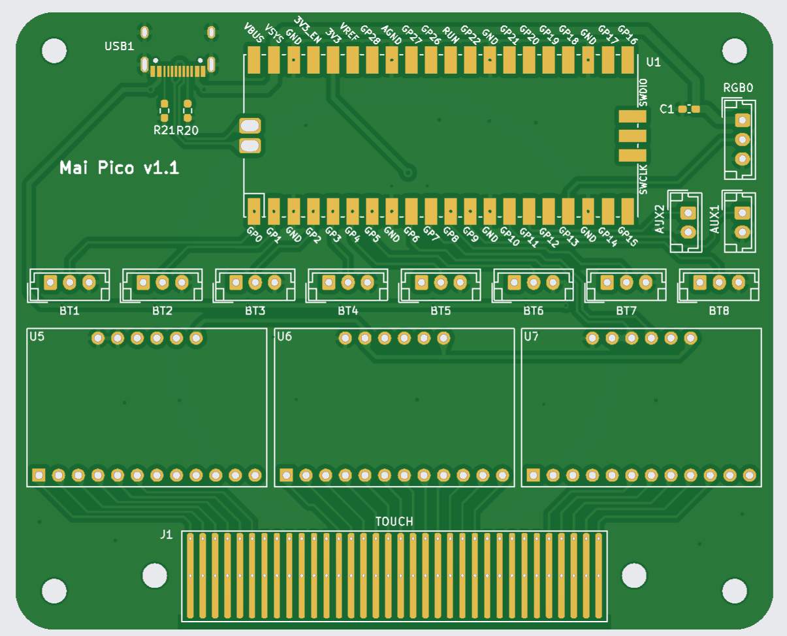
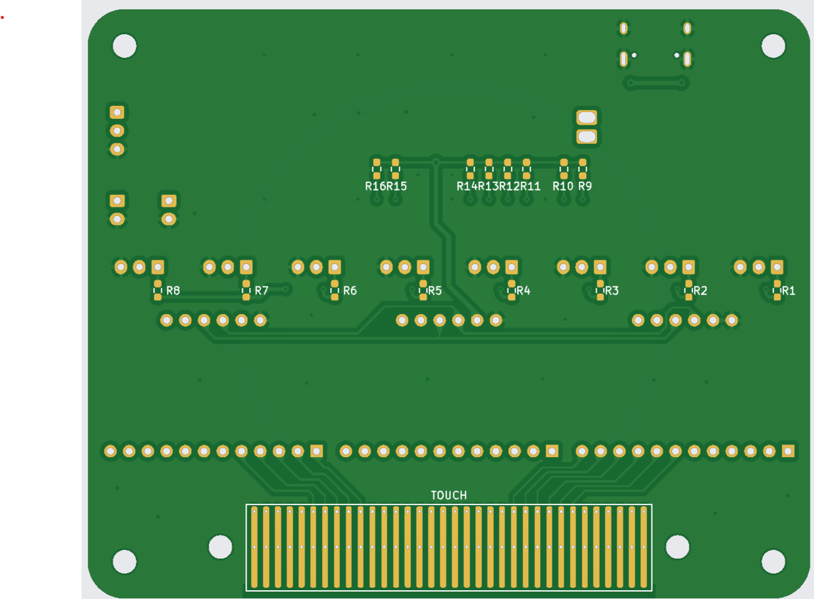

# Materials:
| Component | Description | Source / Link | Qty | Cost (approx.) |
|------------|--------------|----------------|------|----------------|
| **Display** | Elo 4363L 42" open-frame touchscreen | [EloTouch 4363L](https://www.elotouch.de/open-frame-touchscreens-4363l.html) | 1 | ~$500 |
| **Main Buttons** | Large arcade dome buttons | [Alibaba](https://www.alibaba.com/product-detail/Arcade-Machines-Video-Games-Coin-Operated_1600995755848.html) | 8 | $166 |
| **Button Resistor**  | 220 ohm (for 5v) (you need SMD ones for the 1.1v mai_pico board! see note below) | anywhere | 8 | 0.50 |
| **Spacers** | 3D-printed spacers (Syndric STL) | [Maispacer_blank v12](https://github.com/Syndric/maimai-controller-fullsize/blob/master/cad/Spacer/Maispacer_blank%20v12.stl) | 8 | Filament only |
| **Extra Buttons** | Red & blue buttons (Insert Coin / 1P Select) | [Amazon DE](https://www.amazon.de/-/en/dp/B01N11BDX9) | 2 | €10.88 |
| **Faceplate** | 12 mm white birch plywood, OBI-cut | Local hardware store (OBI) | 1 | €90 |
| **NFC Reader** | PN532 RFID/NFC module | [Amazon DE](https://www.amazon.de/-/en/dp/B0D86CPN5J) | 1 | €15 |
| **Stand** | Onkron TS1380 rolling VESA stand | [Onkron.de](https://onkron.de/products/tv-stander-neigbar-90-50-83-zoll-rollbar-hohenverstellbar-kippbar-vesa-fur-touch-screens-panels-ts1380-schwarz) | 1 | ~$260 |
| **LED PCBs** | rabbit_mai_rgb button LED boards | [Syndric GitHub](https://github.com/Syndric/maimai-controller-fullsize/tree/master/pcb/rabbit_mai_rgb/rabbit_mai_rgb-backups) | 8 | €7.50 (JLCPCB) |
| **LEDs** |  WS2812B | https://www.roboter-bausatz.de/p/10-stueck-smd-rgb-led-ws2812b  | 16 (but you should get extras) | €5.00 | 
| **LED Capacitor | 0603 1uF SMD | https://www.reichelt.com/de/en/shop/product/mlcc_0603_1_uf_10_v_x5r_-10_-410134  | 16 (but you should get extras) |  €1.00 |
| **I/O Board** | mai_pico button input PCB | [whowechina GitHub](https://github.com/whowechina/mai_pico/tree/main/Production/PCB) | 1 | €7.50 (JLCPCB) |
| **Connectors** | JST-XH assorted kit | [Amazon DE](https://www.amazon.de/-/en/dp/B07VW8F1NB) | 1 | €28.99 |
| **Wiring** | Multi-color stranded hookup wire | [Amazon DE](https://www.amazon.de/-/en/dp/B089N4SWC1) | 1 | €10.90 |
| **Miscellaneous** | Cable clips, tape, solder, screws, washers | Local hardware store | — | ~$15 |

### Display:
https://www.elotouch.de/open-frame-touchscreens-4363l.html

This is a somewhat controversial choice. 

Latency/Accuracy; Most guides suggest a touch screen display is not suitable for high level play. So far this option has been totally sufficient for around level 10-11 play (I havent attempted higher yet..). it might be that on higher levels of play that its not good enough. I'm not there yet so I cant say. I will say the touch responsiveness and latency so far have been great. Perfect timing taps are super easy. It supports 10 point touch. I do suspect that "circular slides" on the touch screen may cause some trouble.

Cost; Brand new options are far too expensive. I was able to find it on offer for around $500. You might be able to find a similar option.

One last note that made this display a working option compared to other touch displays, is that only skin touch is registering as a touch. The front faceplate of my build sits directly above the screen with a small foam cushion between the board and display. This foam cushion does not register a touch and doesnt interfere with the touch screen. 

### Buttons (8x):
There is a variety of button options for the project, including 3d printing your own. 

I bought 8 of these from alibaba:

https://www.alibaba.com/product-detail/Arcade-Machines-Video-Games-Coin-Operated_1600995755848.html?spm=a2756.trade-carp.valid-supplier.3.184a3192s4dIyb

The quality is great and I am happy with it. This was one of the bigger purchases; 8x $12.50  + shipping + tax = $166

 

### Spacers 
8 x 3d printed spacer (Cost of filament)
I printed at home (ender 3 s1 pro printer) the file from Syndric's github: https://github.com/Syndric/maimai-controller-fullsize/blob/master/cad/Spacer/Maispacer_blank%20v12.stl

### Extra Buttons:
2 x Arcade Buttons (10.88 total)
I used the red and blue button from this set for the "Insert Coin" and "1P Select" button: 
https://www.amazon.de/-/en/dp/B01N11BDX9?ref_=ppx_hzsearch_conn_dt_b_fed_asin_title_1

### Faceplate
1 x 12mm white birch plywood (90 euro including cuts)

I'm going to refer to the board that is between the buttons and the display as the Faceplate. 
I used a single 12mm white birch plywood. I also had OBI (hardware store) cut out the shape I needed. The cost of the cuts and the materials was about 90 euros. 

### NFC Reader:

1 x PN532 : https://www.amazon.de/-/en/Module-Binghe-Pieces-Communication-Compatible/dp/B0D86CPN5J/ref=sr_1_5?crid=1BHPWDPD6GNNP&sprefix=pn532%2Caps%2C339&sr=8-5

I 3d printed a random PN532 enclosure from thingiverse. Sorry I dont know which one anymore.

### Stand

1 x https://onkron.de/products/tv-stander-neigbar-90-50-83-zoll-rollbar-hohenverstellbar-kippbar-vesa-fur-touch-screens-panels-ts1380-schwarz - $260

 

### Button LEDs:

8x PCB design from Syndric: https://github.com/Syndric/maimai-controller-fullsize/tree/master/pcb/rabbit_mai_rgb/rabbit_mai_rgb-backups

### IO Board:

1 x mai_button PCB design from wewhochine https://github.com/whowechina/mai_pico/tree/main/Production/PCB
(Do not use the LED pcb from his build! see above.)

v1.1 pictures for reference: 

Top:  
Bottom:  

### JST connectors:

Lots of JST-XH connectors. I bought this for  €28.99  : https://www.amazon.de/-/en/dp/B07VW8F1NB?ref_=ppx_hzsearch_conn_dt_b_fed_asin_title_1&th=1

### Wire:
I used this and just removed the blue wire. €10.90
https://www.amazon.de/-/en/dp/B089N4SWC1?ref_=ppx_hzsearch_conn_dt_b_fed_asin_title_7 

### Misc:
Cable clips, electical tape, solder, various screws, washers, etc. $15

### Button Resistors
In the newer version of the mai_pico io board, you can put directly the resistors needed for the button sensor on the board. I didnt have this option, so I put resistor in line with the wire going to the button by cutting the wire, twisting the resistor ends around the wire, soldering it, then covering it with electrical tape. 