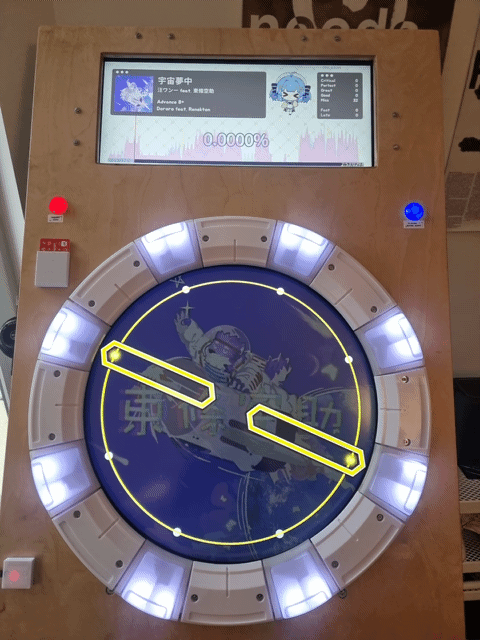
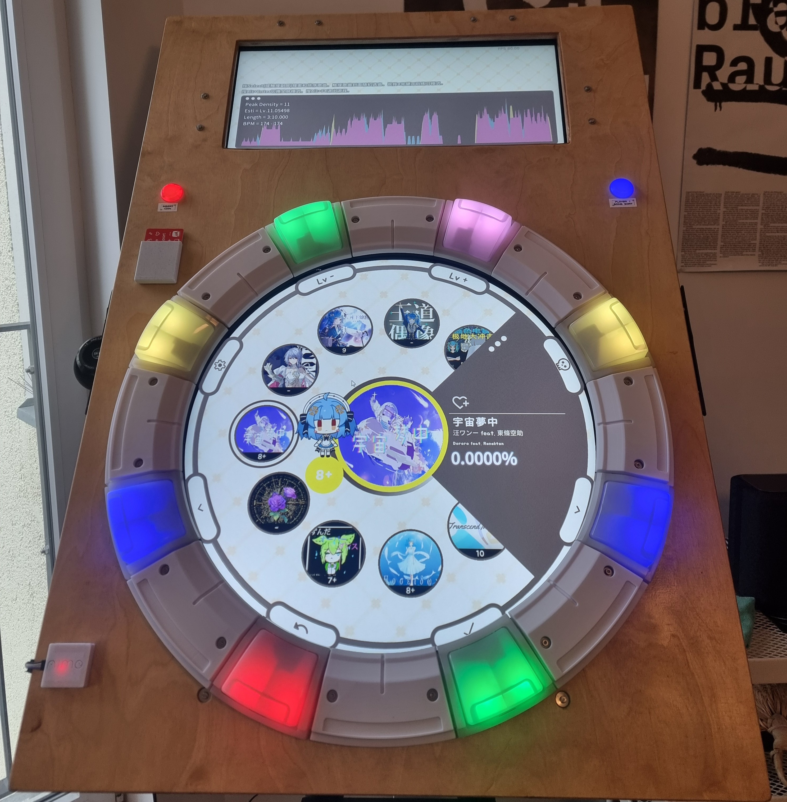
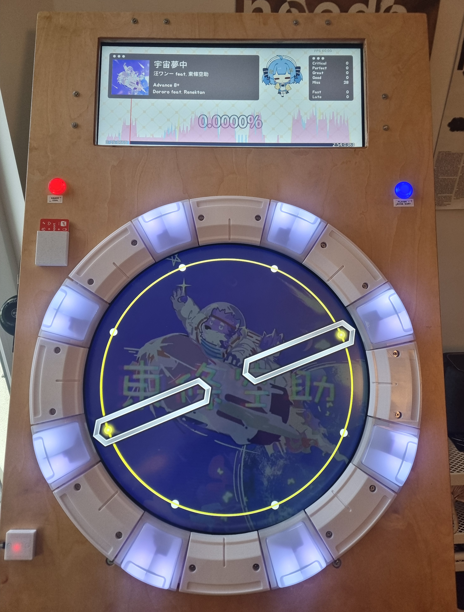
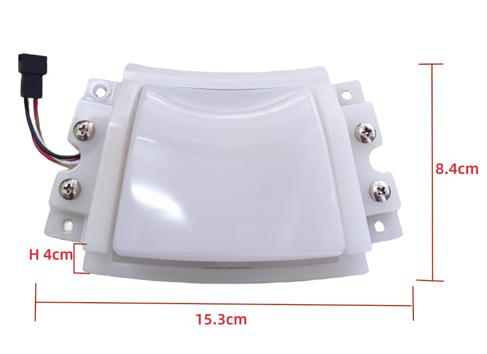
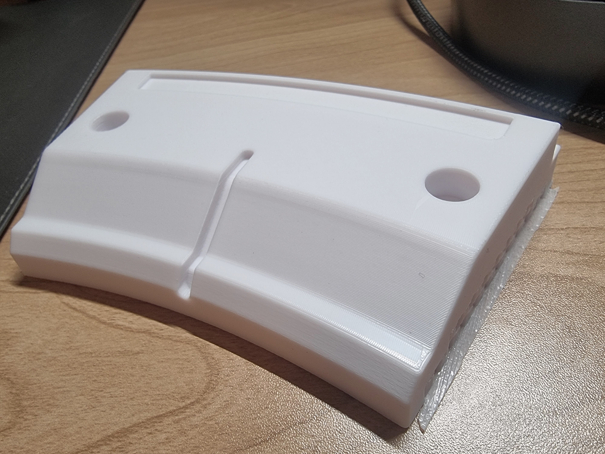
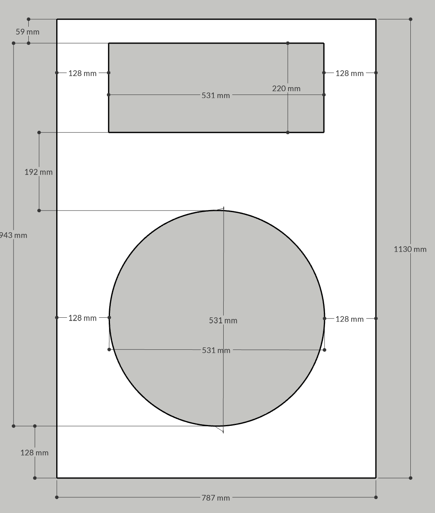
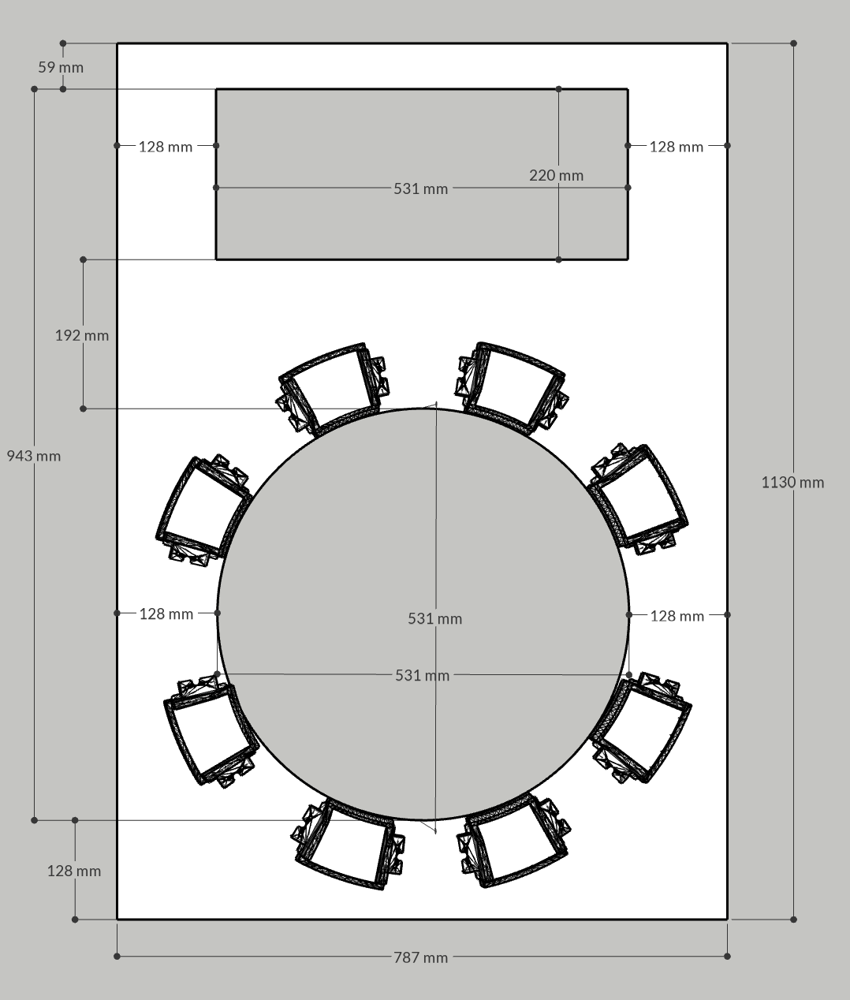
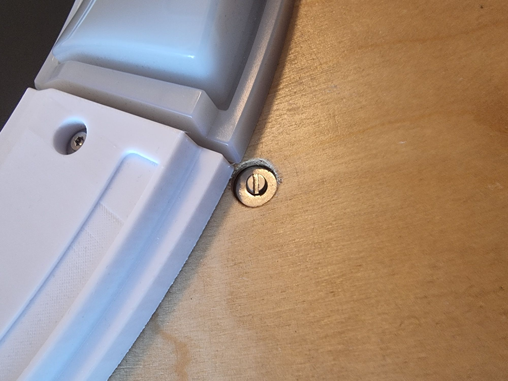

# maicab_fullsize
A collection of notes and lessons learned from building a maimai-like home arcade cabinet. 
This is not meant as a "guide" as its unlikely your build will be the same as mine. Instead, hopefully the lessons learned here can help you in your own similar project. 

*What is MaiMai?* : 
It's like Dance Dance Revolution, but for your hands. Explanation: https://youtu.be/TCW5DejMcog?t=46

Special thanks to these guides and the help they offered:
- https://github.com/whowechina/mai_pico
- https://github.com/ir0nq/maimai-homemade-controller
- https://github.com/Syndric/maimai-controller-fullsize

## Finished Project:

Here is a look at the finished project running Majdata Play. (Majdata Play is an open-source software that allows you to play custom charts for maimai.) https://github.com/LingFeng-bbben/MajdataPlay
 

# Materials
Check the [Materials](Materials.md) page for a BOM and some notes. 

# Lessons Learned

## Buttons

I bought the buttons from a seller on [Alibaba](https://www.alibaba.com/product-detail/Arcade-Machines-Video-Games-Coin-Operated_1600995755848.html) . They are very good quality and seem like the real thing as far as I can tell. 

### Button Sensor:
I cant be sure of the EXACT model number of the sensor, but it seems to be  a **Sharp GP1A73AJ000F**. This is no longer available from places like digikey and mouser, but there is a large inventory in China. I bought replacements from aliexpress: https://de.aliexpress.com/item/1005008751424908.html?gatewayAdapt=glo2deu#nav-specification

It's easy to burn out the sensor if you dont know what you are doing, and directly wire the input to 5v. You need a current limiting resistor. I used a 220 ohm that I spliced in-line between the board and the button. Any 100-220ohm resistor is a safe bet. the 1.1 version of the mai_pico pcb (IO Board) actually accomadates this now: https://github.com/whowechina/mai_pico/blob/main/Production/PCB/mai_button_v111.zip

## Spacers

I printed it with the player facing side up, and high quality settings with ironing enabled (search reddit for ironing settings). Ironing on the top made the part look and feel like excellent quality, its very smooth. I had to enable supports. 

## Faceplate

 
[Sketchup Link](https://app.sketchup.com/share/tc/europe/h4VUo4Tt3_k?source=web&stoken=3EBXgNx8HZxIcI3Zf4U16-ZSuDDfLSql-8k8eOfJ0xX2ZlU9Cw1p_ZszAaV0ycRB)
(Sorry I cant export this without paying now :/ ) 

I created the above diagram for a local hardware store (OBI) and they were able to make the appropriate cuts for me. I was under the impression this would be a CNC done job, but it was not. The job was good enough but not perfect. 

The display I chose ([EloTouch 4636l](https://www.elotouch.de/open-frame-touchscreens-4363l.html)) was intended to be mounted in a custom enclosure, and came with brackets to do so. If for some reason you decide to go the same route, you can request cad drawings directly from their website and get exact information of the size of the screen, the size of the bezel, etc. 

I gave myself an extra margin of about 15cm from the edge of the display, for the bracket mount of the TV and also because the buttons on the bottom, left, and right sides extend beyond the bezel of the display. 

I sanded all edges thorughly to make them round and smooth, as well as the inside bezels of both "windows". 

If I were to do it again I would probably choose painting the wood instead of lacquer. I dont have a workshop so finding a space to dry where it wouldnt get messed with was tricky, so it didnt turn out super great in that regard. I may look into a vinyl sticker to cover the front.

After sanding and finishing the wood, was the scariest part of the entire process: drilling the holes for the bracket screws in the correct position. 

To do this, I put the display on a small table with the edges hanging over the edge of the table. I turned the TV on with majdataplay running on it, so I could see exactly the play circle and the top window. I adjusted and clamped down the faceplate until it was in perfect position, and then very carefully took a sharpie marker and pushed it through the screw hole of the brackets, which were attached to the tv. Then drilled the screw holes. It worked! 

**I also made ~28mm holes on the North / South / East / West sides of the circle.** These would later be necessary for wiring of the buttons and LEDs. If you have the ability to make a slightly bigger hole, it wouldnt hurt but 28mm was plenty. 

The TV brackets are designed in a way to give you a tiny little bit of wiggle roomm. One note is that in the final step of attaching the faceplate to the display, you should attach the brackets to the faceplate like shown. You do not need to tighten down these connections so they are as tight as absolutely possible, it just needs to be nice and snug. the weight of the TV should not be on these brackets anyway, if you are using a VESA mount like me, the display weight is on the mount, and the brackets are only holding the faceplate in place.  (Although if you did decide to decide a different stand that attached to the faceplate, it seems the brackets were intended for this if you look at some of the support materials from elotouch)

I recommend getting some 1 or 1.5mm foam strips / pads to adhere to the back of the faceplate like shown to protect the display from  getting scratched up from the wood. 

  

You will need a [28mm Forstner drill bit](https://www.amazon.de/-/en/dp/B01MTADZX3?ref=ppx_yo2ov_dt_b_fed_asin_title&th=1)  for the screw holes that are under the buttons. You will not be able to attach the buttons / spacers with these bolts sticking out.
