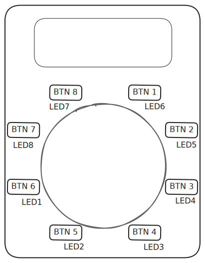
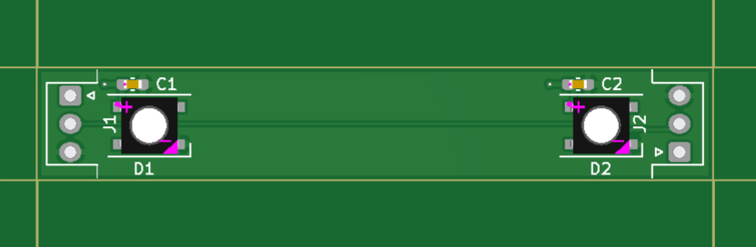
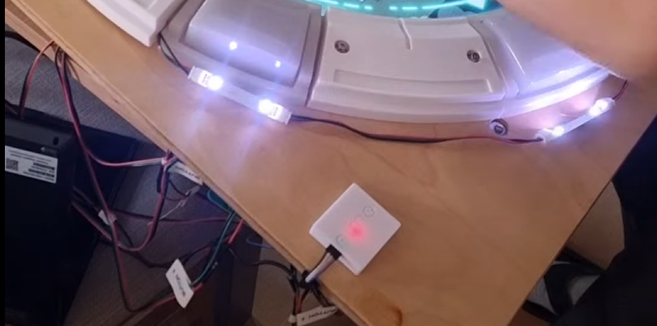
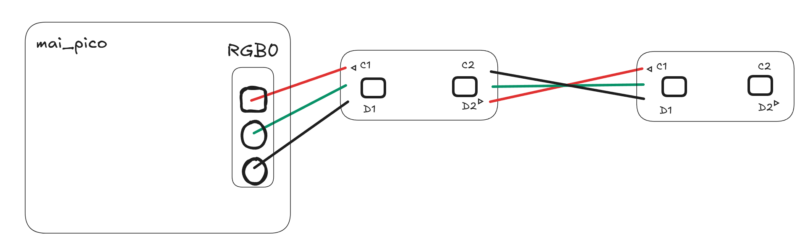
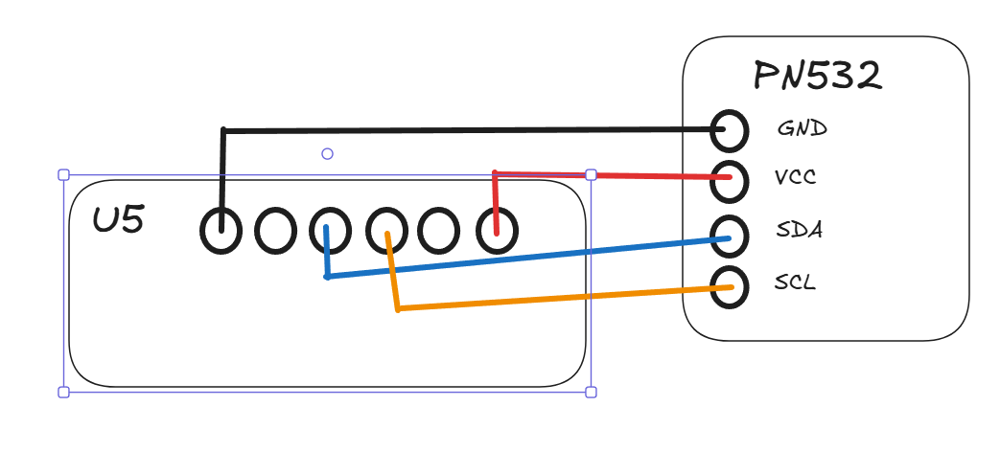

# maicab_fullsize
A collection of notes and lessons learned from building a maimai-like home arcade cabinet. 
This is not meant as a "guide" as its unlikely your build will be the same as mine. Instead, hopefully the lessons learned here can help you in your own similar project. 

*What is MaiMai?* : 
It's like Dance Dance Revolution, but for your hands. Explanation: https://youtu.be/TCW5DejMcog?t=46

Special thanks to these guides and the help they offered:
- https://github.com/whowechina/mai_pico
- https://github.com/ir0nq/maimai-homemade-controller
- https://github.com/Syndric/maimai-controller-fullsize

# License
CC-NC, feel free to modify the project but don't make any money from this guide.

# Finished Project:

Here is a look at the finished project running Majdata Play. (Majdata Play is an open-source software that allows you to play custom charts for maimai.) https://github.com/LingFeng-bbben/MajdataPlay
 

# Materials
<mark>Check the [Materials](Materials.md) page for a BOM and some notes! <\mark>

# Lessons Learned

## Buttons

I bought the buttons from a seller on [Alibaba](https://www.alibaba.com/product-detail/Arcade-Machines-Video-Games-Coin-Operated_1600995755848.html) . They are very good quality and seem like the real thing as far as I can tell. 

### Button Testing and mai_pico setup

When I first started, I wanted to test one button first, before wiring up all 8. Here is my advice for doing so:

In the mai_pico command line, you will need to turn on the "tweak" for making the main buttons normally-on inputs if you are using full size Maimai buttons. These buttons send an On signal by default, and an Off signal when pressed, so it needs to be reversed in the mai_pico firmware. 

However when you do this when you do NOT have all 8 buttons wired, the firmware will give an error of a "stuck" button. 

To get around this, set all 8 buttons to the button you have wired! For example if your button is connected only on gpio pin 2 , run the command:

`gpio main 2 2 2 2 2 2 2 2`

Then that button will register inputs for all 8 buttons, and you can be sure its working without wiring up all 8 buttons. 

The default IO mode for the buttons is called IO4, basically a joypad input. To see if the button input is working or not, just open the [Windows Set Up Game Controllers  settings](https://gr33nonline.wordpress.com/2021/01/10/how-to-test-a-game-controller-on-windows-10/), where you can see the button press register on the controller that should be listed there coming from the mai_pico.  

Even though it might be tempting to use GPIO 0-7 for the buttons, **do not**. Do not try to use pins 6 and 7 for buttons. They are reserved for other uses (touch input), and you will have a bad time. Just stick to the default GPIO ( 0 1 2 3 4 5 8 9 ). These are the GPIO you will be using with the mai_pico IO board anyway. Additionally, do not worry about mapping buttons to an IO order that makes more sense to you. If you leave it at default, you just plug button 1 into the BTN 1 port of the board and you are done. 

If you want to revert to default, here is the command:

`gpio main 1 0 4 5 8 9 3 2` 

Here is the order of the buttons in terms of gameplay:

**If you left the input as Io4 type, no additional configuration is needed to connect it to gameplay**

### Button Sensor:
I cant be sure of the EXACT model number of the sensor, but it seems to be  a **Sharp GP1A73AJ000F**. This is no longer available from places like digikey and mouser, but there is a large inventory in China. I bought replacements from aliexpress: https://de.aliexpress.com/item/1005008751424908.html?gatewayAdapt=glo2deu#nav-specification

It's easy to burn out the sensor if you dont know what you are doing, and directly wire the input to 5v. You need a current limiting resistor. I used a 220 ohm that I spliced in-line between the board and the button. Any 100-220ohm resistor is a safe bet. the 1.1 version of the mai_pico pcb (IO Board) actually accomadates this now: https://github.com/whowechina/mai_pico/blob/main/Production/PCB/mai_button_v111.zip

You do not need this sensor, the buttons will come with a working one already installed. But these probably have a long lead time to ship and its a good idea to have some on hand in case you ever need to replace one.

## Spacers

I printed it with the player facing side up, and high quality settings with ironing enabled (search reddit for ironing settings). Ironing on the top made the part look and feel like excellent quality, its very smooth. I had to enable supports. 

## Faceplate

 

[Sketchup Link](https://app.sketchup.com/share/tc/europe/h4VUo4Tt3_k?source=web&stoken=3EBXgNx8HZxIcI3Zf4U16-ZSuDDfLSql-8k8eOfJ0xX2ZlU9Cw1p_ZszAaV0ycRB)
(Sorry I cant export this without paying now :/ ) 

One lesson learned as I was trying to choose the right software to make a CAD type drawing, was I eventually learned that [autodesk fusion](https://www.autodesk.com/products/fusion-360/personal) 360 has a somewhat hidden option for a free personal-use license. I think this is the best option around after trying a few. 

I created the above diagram for a local hardware store (OBI) and they were able to make the appropriate cuts for me. I was under the impression this would be a CNC done job, but it was not. The job was good enough but not perfect. 

The display I chose ([EloTouch 4636l](https://www.elotouch.de/open-frame-touchscreens-4363l.html)) was intended to be mounted in a custom enclosure, and came with brackets to do so. If for some reason you decide to go the same route, you can request cad drawings directly from their website and get exact information of the size of the screen, the size of the bezel, etc. 

I gave myself an extra margin of about 15cm from the edge of the display, for the bracket mount of the TV and also because the buttons on the bottom, left, and right sides extend beyond the bezel of the display. 

I sanded all edges thorughly to make them round and smooth, as well as the inside bezels of both "windows". 

If I were to do it again I would probably choose painting the wood instead of lacquer. I dont have a workshop so finding a space to dry where it wouldnt get messed with was tricky, so it didnt turn out super great in that regard. I may look into a vinyl sticker to cover the front.

After sanding and finishing the wood, was the scariest part of the entire process: drilling the holes for the bracket screws in the correct position. 

To do this, I put the display on a small table with the edges hanging over the edge of the table. I turned the TV on with majdataplay running on it, so I could see exactly the play circle and the top window. I adjusted and clamped down the faceplate until it was in perfect position, and then very carefully took a sharpie marker and pushed it through the screw hole of the brackets, which were attached to the tv. Then drilled the screw holes. It worked! 

**I also made ~28mm holes on the North / South / East / West sides of the circle.** These would later be necessary for wiring of the buttons and LEDs. If you have the ability to make a slightly bigger hole, it wouldnt hurt but 28mm was plenty. 

The TV brackets are designed in a way to give you a tiny little bit of wiggle roomm. One note is that in the final step of attaching the faceplate to the display, you should attach the brackets to the faceplate like shown. You do not need to tighten down these connections so they are as tight as absolutely possible, it just needs to be nice and snug. the weight of the TV should not be on these brackets anyway, if you are using a VESA mount like me, the display weight is on the mount, and the brackets are only holding the faceplate in place.  (Although if you did decide to decide a different stand that attached to the faceplate, it seems the brackets were intended for this if you look at some of the support materials from elotouch)

I recommend getting some 1 or 1.5mm foam strips / pads to adhere to the back of the faceplate like shown to protect the display from  getting scratched up from the wood. 

  

You will need a [28mm Forstner drill bit](https://www.amazon.de/-/en/dp/B01MTADZX3?ref=ppx_yo2ov_dt_b_fed_asin_title&th=1)  for the screw holes that are under the buttons. You will not be able to attach the buttons / spacers with these bolts sticking out.

### LEDs

Get the LED pcb here: https://github.com/Syndric/maimai-controller-fullsize/blob/master/production/rabbit_mai_rgb.zip

Note the arrow of the LED faces to the bottom right:

I ran into issues on my first attempt by ordering the wrong type of LED even though the partnumber "WS2812B" matched. The first ones I got, the pins came out halfway up the side of the LED. Check that the ones you order have the pins on the bottom (surface mount type). These I think are a correct example: https://www.roboter-bausatz.de/p/10-stueck-smd-rgb-led-ws2812b

The LED itself is quite small, and without proper soldering equipment / experience , it will be difficult. Consider ordering 15+ boards in total, in case you ruin a few. 

You can also have jlpcb do the soldering / assembly for you if you supply the part numbers. 

If you decide to have JLPCB do the assembly (PCBA) for you, I hope these details help: 

BOM file details:
| Designator | Footprint | JLCPCB Part #  |
|------------|------------|---------------------------|
| C1, C2     | C0603      | C1592                     |
| D1, D2     | SMD5050    | C2761795                  |

CPL File details:
| Designator | Val       | Package                                                        | Mid X  | Mid Y  | Rotation | Layer |
|------------|-----------|----------------------------------------------------------------|--------|--------|----------|--------|
| C1         | C         | C_0603_1608Metric_Pad1.08x0.95mm_HandSolder                    | 128.5  | -86.5  | 0        | top    |
| C2         | C         | C_0603_1608Metric_Pad1.08x0.95mm_HandSolder                    | 168    | -86.5  | 0        | top    |
| D1         | WS2812B   | LED_WS2812B_PLCC4_5.0x5.0mm_P3.2mm                             | 129.95 | -90.15 | 0        | top    |
| D2         | WS2812B   | LED_WS2812B_PLCC4_5.0x5.0mm_P3.2mm                             | 170.05 | -90.15 | 0        | top    |

You may have noticed I left off the JST connectors. In my first attempt, the JST connectors I had were too big, and they did not fit inside the button housing. I think syndric also mentions needing to remove some of the button  plastic to make room (although also they used smaller connectors.). Instead I ommitted the JST connector and soldered the wires directly to PCB and created a chain of LED strips with enough length in the wire to reach the next button.

Sorry I didnt get a better picture when I was working on this part, but you can see the LEDs chained together in this picture:

Wiring Diagram:

#### Configuring Mai Pico LEDS

The LED option in mai pico asks you two things; how many PCB sections you have per button, and how many "Cabinet" leds you have. 
(Cabinet LEDs would be extra LEDs that would light up the housing of the cabinet for example.)
In this build I have one LED PCB per button, and no cabinet LEDs. So the config command is:

`rgb 1 0` 

The firmware by default will light up the buttons when the button is pressed, but you can actually connect it to gameplay directly:
Also check the intructions here: https://github.com/Sucareto/Mai2Touch?tab=readme-ov-file#mai2led-%E4%BD%BF%E7%94%A8%E6%96%B9%E6%B3%95

**Make sure the Mai Pico LED Port is set to COM21 in device manager.**

### Card Reader

Wiring for me looked like this:

If you are using touch, you may need to double solder these wires either here, or directly to your rpi pico pins, whichever you find best. Reference the other guides on this. 

**Make sure Mai Pico AIME Port is set to COM1 in device manager.**