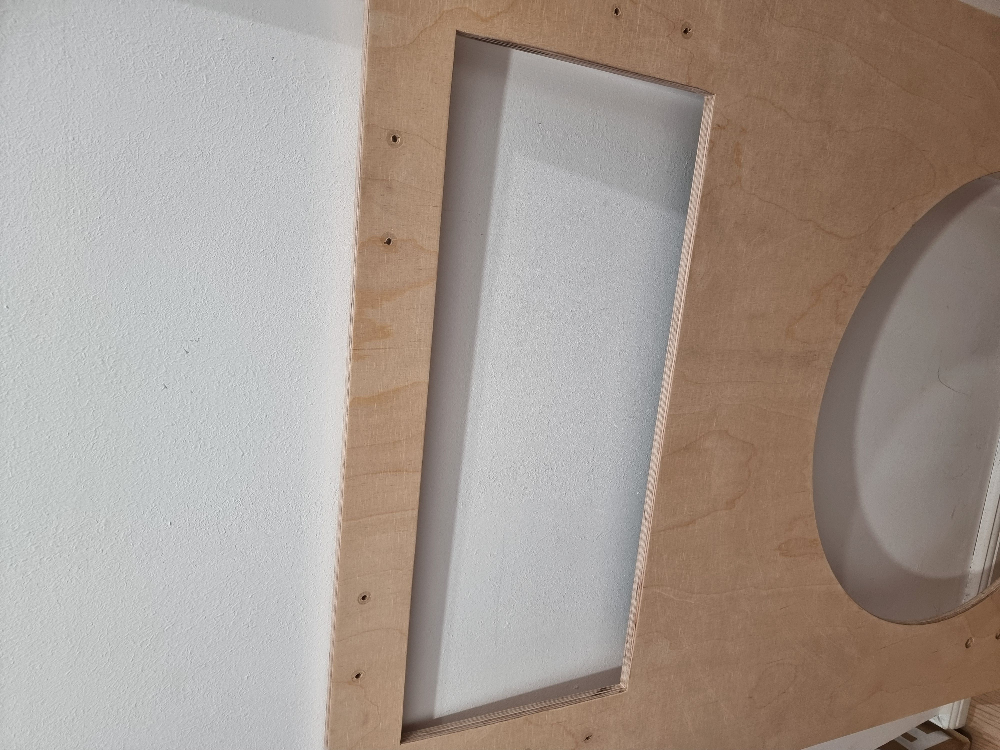

# maicab_fullsize
A collection of notes and lessons learned from building a maimai-like home arcade cabinet. 
This is not meant as a "guide" as its unlikely your build will be the same as mine. Instead, hopefully the lessons learned here can help you in your own similar project. 

*What is MaiMai?* : 
It's like Dance Dance Revolution, but for your hands. Explanation: https://youtu.be/TCW5DejMcog?t=46

Special thanks to these guides and the help they offered:
- https://github.com/whowechina/mai_pico
- https://github.com/ir0nq/maimai-homemade-controller
- https://github.com/Syndric/maimai-controller-fullsize

## Finished Project:

Here is a look at the finished project running Majdata Play. (Majdata Play is an open-source software that allows you to play custom charts for maimai.) https://github.com/LingFeng-bbben/MajdataPlay
 

## Materials:

### Display:
https://www.elotouch.de/open-frame-touchscreens-4363l.html

This is a somewhat controversial choice. 

Latency/Accuracy; Most guides suggest a touch screen display is not suitable for high level play. So far this option has been totally sufficient for around level 10-11 play. it might be that on higher levels of play that its not good enough. I'm not there yet so I cant say. I will say the touch responsiveness and latency so far have been great. Perfect timing taps are super easy. It supports 10 point touch. I do suspect that "circular slides" on the touch screen may cause some trouble.

Cost; Brand new options are far too expensive. I was able to find it on offer for around $500. You might be able to find a similar option.

One last note that made this display a working option compared to other touch displays, is that only skin touch is registering as a touch. The front faceplate of my build sits directly above the screen with a small foam cushion between the board and display. This foam cushion does not register a touch and doesnt interfere with the touch screen. 

### Buttons (8x):

There is a variety of button options for the project, including 3d printing your own. 

I bought 8 of these from alibaba:

https://www.alibaba.com/product-detail/Arcade-Machines-Video-Games-Coin-Operated_1600995755848.html?spm=a2756.trade-carp.valid-supplier.3.184a3192s4dIyb

The quality is great and I am happy with it. This was one of the bigger purchases; 8x $12.50  + shipping + tax = $166

 

### Spacers 
8 x 3d printed spacer (Cost of filament)
I printed at home (ender 3 s1 pro printer) the file from Syndric's github: https://github.com/Syndric/maimai-controller-fullsize/blob/master/cad/Spacer/Maispacer_blank%20v12.stl

### Extra Buttons:
2 x Arcade Buttons (10.88 total)
I used the red and blue button from this set for the "Insert Coin" and "1P Select" button: 
https://www.amazon.de/-/en/dp/B01N11BDX9?ref_=ppx_hzsearch_conn_dt_b_fed_asin_title_1

### Faceplate
1 x 12mm white birch plywood (90 euro including cuts)

I'm going to refer to the board that is between the buttons and the display as the Faceplate. 
I used a single 12mm white birch plywood. I also had OBI (hardware store) cut out the shape I needed. The cost of the cuts and the materials was about 90 euros. 

### NFC Reader:

1 x PN532 : https://www.amazon.de/-/en/Module-Binghe-Pieces-Communication-Compatible/dp/B0D86CPN5J/ref=sr_1_5?crid=1BHPWDPD6GNNP&sprefix=pn532%2Caps%2C339&sr=8-5

I 3d printed a random PN532 enclosure from thingiverse. Sorry I dont know which one anymore.

### Stand 

1 x https://onkron.de/products/tv-stander-neigbar-90-50-83-zoll-rollbar-hohenverstellbar-kippbar-vesa-fur-touch-screens-panels-ts1380-schwarz - $260

### Button LEDs:

8x PCB design from Syndric: https://github.com/Syndric/maimai-controller-fullsize/tree/master/pcb/rabbit_mai_rgb/rabbit_mai_rgb-backups

### IO Board:

1 x mai_button PCB design from wewhochine https://github.com/whowechina/mai_pico/tree/main/Production/PCB
(Do not use the LED pcb from his build! see above.)

### JST connectors:

Lots of JST-XH connectors. I bought this for  €28.99  : https://www.amazon.de/-/en/dp/B07VW8F1NB?ref_=ppx_hzsearch_conn_dt_b_fed_asin_title_1&th=1

### Wire:
I used this and just removed the blue wire. €10.90
https://www.amazon.de/-/en/dp/B089N4SWC1?ref_=ppx_hzsearch_conn_dt_b_fed_asin_title_7 

# Lessons Learned

## Buttons
### Button Sensor:
I cant be sure of the EXACT model number of the sensor, but it seems to be  a **Sharp GP1A73AJ000F**. This is no longer available from places like digikey and mouser, but there is a large inventory in China. I bought replacements from aliexpress: https://de.aliexpress.com/item/1005008751424908.html?gatewayAdapt=glo2deu#nav-specification

It's easy to burn out the sensor if you dont know what you are doing, and directly wire the input to 5v. You need a current limiting resistor. I used a 220 ohm that I spliced in-line between the board and the button. Any 100-220ohm resistor is a safe bet. the 1.1v of the mai_pico pcb actually accomadates this now: 

### Spacers

I printed it with the player facing side up, and high quality settings with ironing enabled (search reddit for ironing settings). Ironing on the top made the part look and feel like excellent quality, its very smooth. I had to enable supports. 

